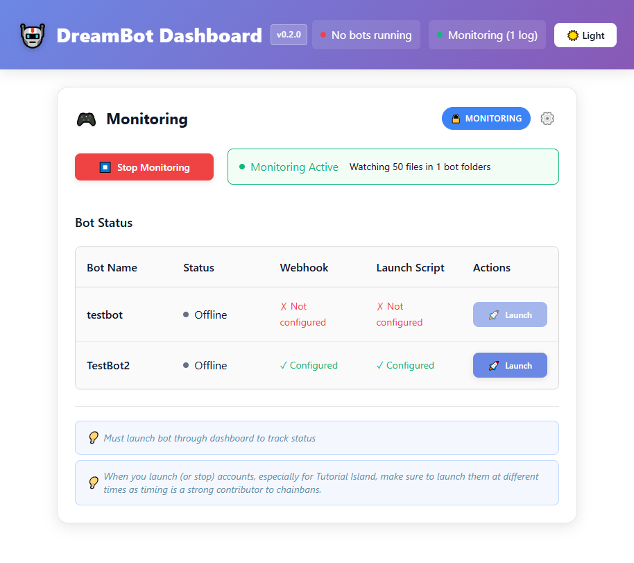

# DreamBot Dashboard

A desktop application for managing and monitoring [DreamBot](https://dreambot.org/) instances with real-time logging, webhook notifications (e.g. Discord), and bot management.

## 🎯 What is DreamBot Dashboard?

DreamBot Dashboard is an Electron-based desktop application that provides a user-friendly interface for managing DreamBot bot instances. It allows you to configure bot settings, monitor bot activities in real-time, and receive notifications through webhooks when important events occur.

## 📸 Screenshot



_The dashboard shows the Monitoring section (top) with bot status tracking and the Configuration section (bottom) with bot setup options._

## ✨ Features

### 📊 Real-Time Monitoring

- **Event Detection**: Automatically detect and process important bot events:
  - Level up notifications
  - Quest completions
  - Valuable drops
  - Chat messages your bot acknowledges and receive (P2P Master AI only)
  - Bot breaks and status changes (P2P Master AI only)
- **Webhook Integration**: Send notifications to Discord channels or any other webhook when events occur
- **Bot-Specific Webhooks**: Use different webhook URLs for different bots (✨Requires DreamBot VIP)

### 🚀 Bot Process Management (✨Requires DreamBot VIP)

- **Launch Bots**: Start bot processes directly from the dashboard
- **Stop Bots**: Safely terminate bot processes and their child processes
- **Status Tracking**: Monitor which bots are currently running (must be launched through dashboard)

## 📥 Download & Installation

### Prerequisites

- **Windows 10/11** (64-bit)
- **DreamBot** installed and configured
- **Node.js** (if building from source)

### Option 1: Download Pre-built Release (Recommended)

1. Go to the [Releases](https://github.com/yourusername/DreamBot-Dashboard/releases) page
2. Download the latest `.zip' for Windows
3. Extract the zip contents into a folder 
4. Launch `DreamBot Dashboard.exe`

### Option 2: Build from Source

```bash
# Clone the repository
git clone https://github.com/yourusername/DreamBot-Dashboard.git
cd DreamBot-Dashboard

# Install dependencies
npm install

# Build the application
npm run build

# Start the application
npm start
```

## 🚀 Getting Started

### First Launch

1. **Launch the Application**: Start DreamBot Dashboard
2. **Configure Logs Directory**: Set the path to your DreamBot logs folder
3. **Set Base Webhook URL**: Configure your default Discord webhook (optional if using bot-specific webhooks)
4. **Enable VIP Features**: Toggle if you have DreamBot VIP subscription to enable VIP Features

### Adding Bot Configurations (✨Requires Dreambot VIP)

1. **Add New Bot**: Click the "+ Add Bot" button
2. **Configure Bot Settings**:
   - **Bot Name**: Enter a unique identifier for your bot
   - **Webhook URL**: Set a Discord webhook for bot-specific notifications
   - **Launch Script**: Enter the command to start your bot

### Starting Monitoring

1. **Save Configuration**: Click "Save" to apply your settings
2. **Start Monitoring**: Click "Start Monitoring" in the Monitoring card
3. **Launch Bots**: Use the "Launch" button to start individual bots
4. **Monitor Status**: Watch real-time updates in the Bot Status table

## 🔗 Discord Webhook Setup

### Creating a Webhook

1. Go to your Discord server settings
2. In a channel's settings, navigate to Integrations → Webhooks
3. Click "New Webhook"
4. Copy the webhook URL
5. Paste it into the Dashboard configuration

### Supported Events

The dashboard automatically detects and sends notifications for:

- **Level Up**: Skill advancements with emoji indicators
- **Quest Complete**: Quest completion notifications
- **Valuable Drops**: High-value item drops with coin amounts
- **Chat Messages**: In-game chat activity your bot recognizes (P2P Master Ai only)
- **Bot Breaks**: Bot start/stop and break notifications (P2P Master Ai only)

## 🎮 Bot Launch Scripts (✨Requires DreamBot VIP)

### What is a launch script?

- Refer to [DreamBot documentation](https://dreambot.org/guides/user-guide/quickstart/) for help with creating a launch script

### Important Notes

- **Use Full Paths**: Include complete paths to Java and DreamBot.jar
- **Quote Script Names**: Enclose script names in quotes if they contain spaces
- **Test Commands**: Verify your launch script works in Command Prompt first

## 🛠️ Troubleshooting

### Common Issues

**"No configuration available" error**

- Ensure you've saved your configuration
- Check that the logs directory path is correct

**Bots not launching**

- Verify your launch script syntax
- Check that Java is in your system PATH
- Ensure DreamBot.jar path is correct

**Monitoring not starting**

- Save your configuration first
- Check that the logs directory exists and is accessible
- Verify bot folder names match your bot configurations

**Webhooks not working**

- Test your Discord webhook URL in a browser
- Ensure the webhook has proper permissions
- Check that the webhook channel is accessible

### Getting Help

- **Check the logs**: Look for error messages in the application
- **Verify paths**: Ensure all directory paths are correct
- **Test manually**: Try running commands manually in Command Prompt
- **Restart app**: Close and reopen the application if issues persist

## 📋 System Requirements

- **OS**: Windows 10/11 (64-bit)
- **DreamBot**: DreamBot OSRS Software
- **Network**: Internet connection for Discord webhooks

## 🔒 Privacy & Security

- **Local Storage**: All configuration is stored locally on your machine
- **No Data Collection**: The application doesn't send data to external servers
- **Webhook Security**: Only webhook URLs you configure are used
- **Process Isolation**: Bot processes run independently of the dashboard

## 📝 License

This project is licensed under the MIT License - see the [LICENSE](LICENSE) file for details.

## 🤝 Contributing

While this is primarily an end-user application, contributions are welcome! Please read our contributing guidelines if you're interested in helping improve the dashboard.

---

**Note**: DreamBot Dashboard is not affiliated with [DreamBot](https://dreambot.org/). DreamBot is a registered trademark of its respective owners.
